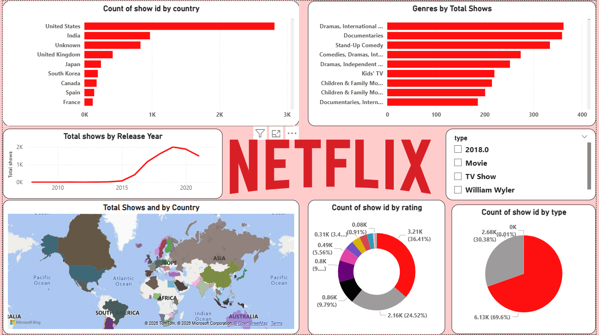

# 🎬 Netflix Content Data Analysis

## 📌 Project Overview
This project analyzes Netflix content data to uncover trends in movies and TV shows, including genre popularity, country-wise production, and content growth over time.

## 🛠️ Tools Used
- Python (Pandas, NumPy)
- Data Cleaning & Exploratory Data Analysis (EDA)
- Power BI (Dashboard)

## 📊 Key Insights
- Movies dominate the platform compared to TV shows
- Certain countries produce the majority of content
- Popular genres drive most of the content
- Content addition has increased over the years

## 📸 Dashboard Preview

## 🎯 Conclusion
This project provides insights into content trends, helping understand audience preferences and platform growth.
